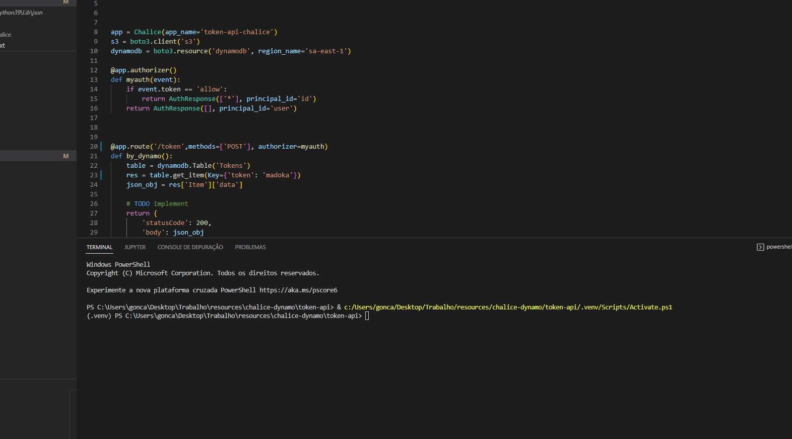

# Chalice Dynamo Token

project to get or rotate complex tokens with simple authentication with chalice!

Requires the enviroment variables of AWS to run properly

# how does it work?

first we need to create a table into dynamo DB and we can do it using the json-to-dynamo so:

- poetry install the dependencies.
- run the python main.py with the parameters:

- -t: token name (str)
- -f: file path of the json to be upload (str)

after it will create a table "Tokens" with your madoka token

example of using:

now you are able to use the magic madoka token! so now we can deploy or test locally the chalice api, so:
- go for token-api path
- poetry install the depedencies
- run the chalice local (for test)
- run the chalice deploy (for deployment)

example of using:

